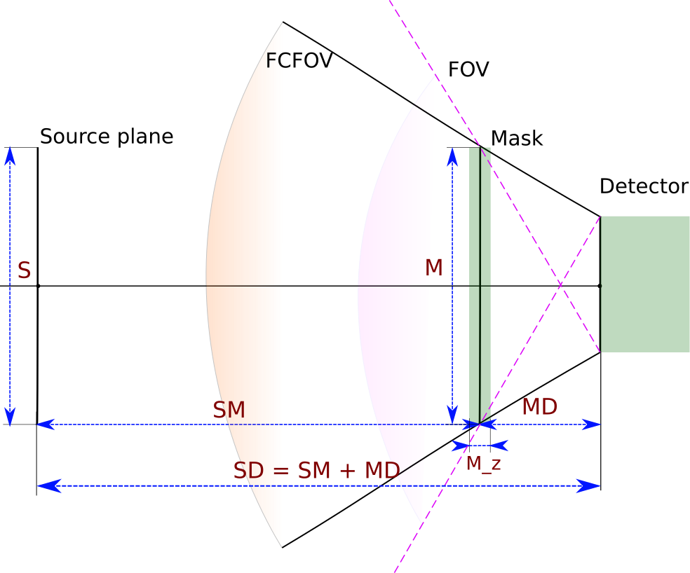

# G4Simulation
*[SIFI-CM][sifi_link] 'simple'[^1] Geant4 Simulation*

- [Prerequisites](#prerequisites)
- [Installation](#installation)
- [General description](#general-description)
- [Usage](#usage)
  - [Simulation](#simulation)
  - [H-matrix calculation](#h-matrix-calculation)
- [Geometry](#geometry)
- [References](#references)

## Prerequisites

* Required ROOT version: 6.24/00
  *For the installation guide look at [root_official][root_install]*[^root]
* Compiler supporting c++17
* CmdLineArgs >= 2.2.0
  *Available in [SiFi-CC/CmdLineArgs](https://github.com/SiFi-CC/CmdLineArgs)*
* mpich
  

## Installation

* Clone the repository
  
``` bash
git clone https://github.com/SiFi-CC/G4Simulation.git
```

``` bash
cd G4Simulation
```

* Prepare submodules (spdlog) by running:

``` bash
git submodule update --init --recursive
```

* Create build directory and compile the code

``` bash
mkdir build && cd build
cmake ..
make -jN
```

* For using visual mode one will need to copy macro files to the build directory as well
  
``` bash
cp ../*.mac .
```


## Geometry



* **SD** - distance from the source plane to the detector
* **SM** - distance from the source plane to the middle of the mask
* **MD** - distance from the middle of the mask to the detector ($SD = SM + MD$)
* **M** - size of the mask in X and Y directions
* **M_z** - mask thickness
* **S** - size of the source plane. This dimension is specified during the system matrix calculation. It determines a space of reconstructed images for a particular matrix.
* **FCFOV** (the fully coded field of view) - angular region which is defined as defined as "comprising all directions for which the detected flux is completely modulated by the mask"[[Caroli et al]](#caroli).
* **FOV** (the field of view) - angular region where "only a fraction of the detected photons is coded by the aperture pattern"[[Caroli et al]](#caroli).

### Some speculations

#### Detector plane

The size of the detector plane is determined by the fibers size and amount. It is hardcoded that the length of a single fiber is **10 cm**. Also it is not hardcoded but recommended to take a width of a fiber as **1.36 mm** (despite the fact that default value is 1.3 mm which should be corrected).

So in **2D** regime, the detector plane would be a square-shaped and one side of such a square would be equal to **nFibres**$\times$**fibre_width**.

In **1D** the size of the detector plane in **Y** direction is always the same as fiber length (10 cm), and in **X** direction it is equal to **nFibres**$\times$**fibre_width**.

The thickness of the detector is always determined as **nLayers**$\times$**fibre_width**

#### Mask

At the moment it is decided to test a `nowallpet` mask (or `nowallpetcut`) for the **2D** mode (the practical implementation can be slightly different for the **1D**). For that purpose the Tungsten rods had been ordered together with the first PET raster. It has been done for the **31 order** mask, with the size **M = 70 mm** and **M_z = 20 mm**. So each rod is in size $70/31 \approx 2.3 \text{ mm}$. The number of rods available is **480**(or so?) This information should be taken into account when constructing another mask patterns - that is the single pixel size should kept the same (no matter it is **1D** or **2D**).

At the same time, it can be considered to use larger mask, but additional rods should be ordered than.

#### Geometry parameters

At this point experiments with geometry parameters led to finding optimal (*or just better than other in some particular cases*) values and set-ups.

##### Small-scale prototype  

64 fibers in total, tested with 4 layers by 16
(can be also arranged in 2 layers by 32 or 1 layer with 64 fibers)

- SM = 170 mm
- MD = 50 mm
- M = 70 mm
- M_z = 20 mm
- S = 70 mm
<!-- - Number of points in the source plane: 100x100=10000 -->

## Usage

The program operates in 2 modes. [The first](#simulation) of them is used to simulate an experiment of $\gamma$-particles being shot towards the detector. And [the second](#h-matrix-calculation) - for the calculation of the system matrix (needed for the reconstruction).

The general procedure is very similar for both modes. The basic difference is that the second performs a set of single simulations and combines them together in the form of `system matrix`.

### Simulation


```shell
./cmd/custom_simulation.cp output.root [optional arguments]
```

`output.root` is a name of the output root-file.


##### Optional arguments  
*(detailed description below the table)*

| Parameter                 | Default       | Type   |  Description   |   
| :----: |:---:| :--:| :--------|
|  `-det`            |    220:16:1.3    | float:int:float | Detector parameters: SD[^sd]:nFibres:fibre_width [mm/-/mm]
|  `-nlay`            |    4    | int  | Number of layers in detector
|  `-mask`            |    31:170:70:20    | int:floats | Mask parameters: order:SM:M:M_z [mm]
|  `-masktype`            |    standard    | string  | Mask type: \{`standard`, `round`, `pet`, `nowallpet`, `nowallpetcut`\}
|  `-cut`            |    31    | int  | Number of pixels in mask, (relevant only if masktype=nowallpetcut)
|  `-er`            |    0.0    | float  | Error in W rods size [mm], (relevant only if `masktype`=`nowallpetcut`)
|  `-source`            |    0:0    | float:int  | Source coordinates [mm]
|  `-sourceBins`            |    70:100    | int  | Range and number of bins in the source histogram
|  `-n`            |    1000    | int  | Number of generated events
|  `-e`            |    4400    | int  | Energy of particles [keV]
|  `-theta`            |    auto    | int  | Min $\theta$ angle [Deg], (maximum $\theta$ is 180)
|  `-sMac`            |    none    | string  | mac-script to change source parameters
|  `-vis`            |    none    | flag  | Run in visual mode(no simulation is performed)
|  `-1d`            |    none    | flag  | Mask and detector are single-dimensional


**Parameter -det**

List of 3 values which define define geometry parameters, connected to the detector.
First one is `detector-source`, that is a distance between the source and the detector.
This parameter is followed by the number of fibers in the single layer and width of a single fiber.

**Parameter -nlay**

This parameter allows user to set a number of the layers in the detector.


**Parameter -mask**

List of 4 values which define define geometry parameters, connected to the `MURA mask` .
First one defines an order of the mask (should be a prime number). Second value is `mask-source`, that is a distance between the source and the mask.
The last 2 parameters are the width(and the length - as the mask is a square) and thickness.
    

**Parameter -masktype**

Specify the type of implementation of the MURA mask. It should be one of the following options:

* `standard` - ideal (theoretical) case when the mask is truly binary and has no walls between the pixels

* `round` - the mask is constructed as a Tungsten monoblock, where in places of empty pixels are round-shape
holes

* `pet` - the mask has a `PET raster` where it is possible to put Tungsten rods and prepare any pattern. The size of rods is hardcoded as a 90% of the full pixel size.

* `nowallpet` - similar to `pet` but the raster is prepared specifically to the particular pattern. It means that empty pixels are filled with PET and it allows to avoid having walls.

* `nowallpetcut` - the same as `nowallpet` but allows option `-cut` to be activated


**Parameter -cut**

If `-masktype=nowallpetcut`, the cut parameter specifies a size of mask's central area to be used. For example if mask order is 467 and `-cut=31`, then only 31X31 central pixels of the 467's order MURA mask will be used.


**Parameter -er**

Specifies the error in the size of Tungsten rods. If used, than  from the each dimension of each rod is subtracted a random number 
from the distribution: $er/2 - N(er/2, er/6)$


**Parameter -source**

The list of 2 numbers, which specifies a coordinates of the source (or the center of the source if not point-like).

**Parameter -sourceBins**

The list of 2 values (float and int) to specify a source histogram range and number of bins. The first of them is a size of the plane in [mm] and the second is a number of source positions in each direction (positions are uniformly distributed among the source plane). 


**Parameter -n**

Number of generated events.


**Parameter -e**

Energy of generated $\gamma$-particles [kEv].


**Parameter -theta**

This parameter allows to set the $\theta_{min}$ angle [deg]. 
$\theta_{max}$ is always $180^o$ (parallel to the source-detector axis). It means that particles will be shot with angles $[\theta_{min}, 180^o]$.


**Parameter -sMac**

Path to the `mac`-script with additional specifications of the source. It allows to change type and shape of the source distribution.

<!-- ```
Example !TODO
```  -->


**Parameter -vis**

If this flag is used, the programs runs in visual mode[^2]. That is Geant4 graphical interface is opened with specified geometry setup.  


**Parameter -1d**

If this flag is used, the detector and mask are constructed in a singe-dimensional mode along x-axis  


### H-matrix calculation

```shell
mpirun -np n_cores ./cmd/mpi_gen_sim_matrix.cp output.root [optional arguments]
```

`n_cores` - is a number of parallel processes (number of cores used).

`output.root` is a name of the output root-file.

The most of the optional arguments are the same as for the [simulation](#optional-arguments), but some of them are not used or have different meaning.

##### Optional arguments

| Parameter                 | Default       | Type   |  Description   |   
| :------------------------: |:-------------:| :-------------:| :-------------|
|  `-det`            |    220:16:1.3    | float:int:float | Detector parameters: SD:nFibres:fibre_width [mm/-/mm]
|  `-nlay`            |    4    | int  | Number of layers in detector
|  `-mask`            |    31:170:70:20    | int:floats | Mask parameters: order:SM:M:M_z [mm]
|  `-masktype`            |    standard    | string  | Mask type: \{`standard`, `round`, `pet`, `nowallpet`, `nowallpetcut`\}
|  `-cut`            |    31    | int  | Number of pixels in mask, (relevant only if masktype=nowallpetcut)
|  `-er`            |    0.0    | float  | Error in W rods size [mm], (relevant only if `masktype`=`nowallpetcut`)
|  `-source`            |    70:100    | float:int  | Range and number of bins in the source plane
|  `-n`            |    1000    | int  | Number of generated events for each source position
|  `-e`            |    4400    | int  | Energy of particles [keV]
|  `-1d`            |    none    | flag  | Mask and detector are single-dimensional. The source position is shifted only along one dimension (`x`)

#### **Parameter -source**

The list of 2 values (float and int) to specify a source plane parameters. The first of them is a size of the plane in [mm] and the second is a number of source positions in each direction (positions are uniformly distributed among the source plane).[^3]


*All the rest parameters have the same meaning and usage as for [Simulation](#simulation)*

## References

<a id="caroli">[Caroli et al]</a> : Caroli, E., Stephen, J.B., Di Cocco, G. et al. Coded aperture imaging in X- and gamma-ray astronomy. Space Sci Rev 45, 349–403 (1987). https://doi.org/10.1007/BF00171998


<!-- Footnotes -->
[^1]: The simulation is simpler than [one of JK](https://bragg.if.uj.edu.pl/gccbwiki/index.php/SiFi-CC/SiFi-CM_Geant4_Simulation) in a sense that it does not take into account a lot of details (electronics, fibers coupling etc.).

[^2]: Parameters of the graphical interface can be set in the file `vic_CC.mac` which is executed before the opening of the viewer and should be placed in the working directory.


[^3]: Usually it is convenient to set [`-sourceBins`](#parameter-sourcebins) parameter for the simulation to be the same as [`-source`](#parameter-source) parameter of system matrix for the further comparison of reconstructed image and original source histogram.

[^root]: Be aware that ROOT may not be using C++17 by default and one will need to compile it using option `-DCMAKE_CXX_STANDARD=17` 

[^sd]: The decryption of some abbreviations can can be found at the [Geometry](#geometry) section.

<!-- Links -->
[sifi_link]: https://bragg.if.uj.edu.pl/gccbwiki/index.php/Main_Page "SiFi-CC"
[root_install]: https://root.cern/install/ "ROOT"